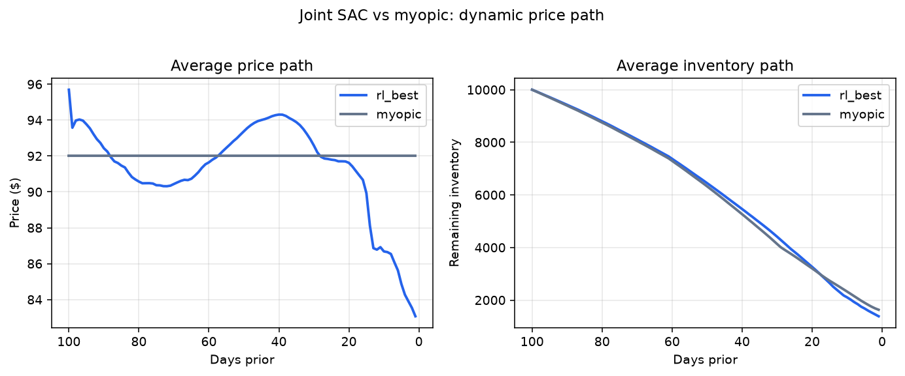
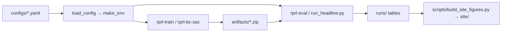

# Reservation pricing and availability control with RL

[](https://github.com/jjd-lab/revenue-manage-rl/actions/workflows/test.yml)
[](LICENSE)


Config-driven revenue management for a fictional 10,000-seat amphitheater. Each day of a 100-day booking window the agent sets a price, from $80 to $120, and a selling limit, from 10,000 to 15,000. Demand is synthetic. A tree sets the base from the calendar and from how far out the night is. Price scales that base around $100. Cancellations follow a Weibull curve. No-shows run near 16 percent. No real box office is in this repository.

A joint policy sets the price and the selling limit. A price-only policy sets the price, and a formula sets the limit. The cap is applied after training. It lowers a joint policy's selling limit when expected show-ups would pass 1.02 times the 10,000 seats. It does not retrain the policy. Pluggable demand models, classical baselines, and Stable-Baselines3 PPO and SAC are included. TD3 is registered and smoke-tested, and it appears in no published result.

## The result

Thirty held-out nights, seeds 0 to 29, in June and December. Thirteen are soft. Seventeen are peak. On a soft night, even $80 with the selling limit wide open leaves more than 1,500 seats empty, so those nights are scored against a price of $80 rather than against empty seats. On a peak night the score is revenue, minus $200 for each unsold seat and $400 for each oversold seat. An oversold seat is a denied admission: a show-up with no seat.

On the published training, seed 42, raw Joint BC to SAC and the same policy under the cap tie each other. Both beat every other row. The cap takes denied admission from 0.71 of peak nights to zero. The paired interval on the score cost of that cap covers zero, so the two scores are a tie.

Capped Joint BC to SAC scores 3.6 percent higher than pace PPO, and the paired interval on that gap sits above zero. Joint SAC against pace PPO, and Joint PPO against pace PPO, have paired intervals that cover zero. A gap ranks two policies only when its paired interval excludes zero.

That 3.6 percent lead does not repeat on every training seed. Seeds 43 and 44 beat a pace run from the same seed. Seed 46 ties its matched pace run and scores below the published pace checkpoint. On seeds 43 and 44 the cap leaves denied admission on 0.24 and 0.47 of peak nights.

Myopic sets a selling limit of 12,353 and never holds more than 11,402 bookings, so changing that limit does not change revenue. Pace PPO is the price-only comparison, because it sets only the price.

| Policy | Controls | `score_aware` | Peak nights with denied admission |
| --- | --- | ---: | ---: |
| Joint BC to SAC, no cap | price and selling limit | 2.094M | 0.71 |
| Joint BC to SAC with the cap | price and selling limit | 2.081M | 0.00 |
| Joint SAC | price and selling limit | 2.033M | 0.18 |
| Pace PPO | price only | 2.010M | 0.00 |
| Myopic | price, limit does not bind | 1.972M | 0.00 |

The table is point estimates on seeds 0 to 29. Apply the cap to Joint SAC and Joint PPO as well and all three joint policies reach zero denied admission, giving up 0.6 to 2.4 percent of score. The paired interval supports a lead over pace PPO only for capped Joint BC to SAC. Capped Joint SAC's point estimate ties pace PPO. Capped Joint PPO's point estimate falls below both price-only policies. Those two capped rows were not saved night by night, so they have no paired interval ([§10](docs/EXPERIMENT_LOG.md)).

Pinning a joint policy's selling limit, and leaving the price alone, costs $90,000 to $344,000 and sends the share of peak nights with denied admission to 0.82 ([§9](docs/EXPERIMENT_LOG.md)). The limit changes the result. It does not, by itself, make every joint policy beat pace PPO.

Full table: [`docs/EXPERIMENT_LOG.md`](docs/EXPERIMENT_LOG.md) §7. The same numbers, with the charts, are at **<https://jjd-lab.github.io/revenue-manage-rl/>** (source in [`site/`](site/index.html), deployed by `.github/workflows/pages.yml`).



*Joint SAC. Nine weekend nights go from about $109 a hundred days out to $117 around day 37, then down to $89. Twenty-one weekday nights ease from about $90 to $80. Myopic is $92 on every night. Figures: [`runs/explain_rl_best/`](runs/explain_rl_best/README.md).*

### Later buyers never pay less

That weekend line rises to $117 and then falls to $89. A buyer on the last day pays less than one who booked three weeks earlier. A venue cannot do that to the people who booked early, so `control.price_monotone` forbids it: the price may rise and may never fall.

Blocking the drops earns more than allowing them. Take the trained policy unchanged and refuse any price below yesterday's, and `score_aware` goes from 2,033,264 to 2,077,976, with the paired interval above zero. The weekend path climbs from $108.50 to $118.20 and holds. No retraining. The block overrides the policy on 2,610 of its 3,000 daily decisions, so the late markdown was not a small mistake.

Training under the rule is the part that does not work. Every retrained arm lands about 110,000 below the blocked policy, and the retrained price path stops moving: $116.31 on every weekend day, the $80 floor on weekdays. Opening cheap is what keeps the most options under a rule that only lets the price rise. Cloning the blocked policy reaches 2,038,966 with no markdowns, a tie with the unconstrained reference — but only without fine-tuning, which undid it at every setting tried. The fine-tune is not failing. It raises the training reward by up to 76%. The reward charges about $730 for any unsold seat and takes away the whole fill bonus on a night with even one denied admission. The score charges nothing for an unsold seat on a soft night. So the fine-tune drops soft nights to the floor and stops overbooking peak nights by selling less, and both moves cost score. A penalty is not a substitute: the best of four weights still cut the price 1,377 times.

The recommendation is to train without the rule and apply it at decision time ([§12](docs/EXPERIMENT_LOG.md), [`runs/price_monotone_up/`](runs/price_monotone_up/NOTES.md)).

### The reward decides the overbooking

Every policy above learned from one reward: about $730 per unsold seat, and the whole fill bonus lost on any night with a denied admission. Retraining Joint SAC on a simpler rule — revenue, minus $200 per unsold seat and $400 per denied admission, the same every night — raises `score_aware` from 2,033,264 to 2,087,750, with the paired interval above zero. All of the gain is peak nights, through overbooking: denied admission on 11 of 17 peak nights, up from 3. Behind the cap it scores 2,095,566, but 2 peak nights still deny admission, where the cap had reached zero on every other joint policy. The weights act as prices, and the ranking depends on them. The score also charges $400 per denied admission. The new policy denies 216.3 more seats per peak night, so its lead is gone at about $652 per denied admission. One training seed ([§13](docs/EXPERIMENT_LOG.md), [`runs/objective/`](runs/objective/NOTES.md)).

## Scenario

A fictional 10,000-seat house sells one night's seats over 100 days. Each day the policy sets a price and a selling limit. People cancel, and some of those who keep the booking do not arrive, so the selling limit may sit above 10,000. Bookings above the seats that exist are the buffer against cancellation and no-show.

Everything here is **synthetic**. The base-demand corpus comes from
`synthetic_base_demand_mean` in `src/reservation_pricing/demand/synthesize.py`, and
the shipped `demand/assets/tree_base_demand.joblib` is fitted on that generated
corpus. No real booking data is used anywhere in this repo.

## Install

```bash
python3 -m venv .venv
source .venv/bin/activate
pip install -U pip
pip install -e ".[dev]"
```

Python 3.10+ (developed on 3.13; CI runs 3.10 and 3.13). Run commands from the
repo root with `.venv` active. `pip install -e ".[dev]"` resolves the version
ranges in `pyproject.toml` fresh; to install the exact set the tables in `runs/`
were produced with instead:

```bash
pip install -r requirements.txt
```

| Command | Purpose |
| --- | --- |
| `rprl-train` | Train one algorithm from an experiment YAML |
| `rprl-eval` | Evaluate a checkpoint against a config |
| `rprl-baselines` | Run the classical baselines only |
| `rprl-bc-sac` | Behaviour-cloning warm start, then SAC |
| `rprl-tune` | Hyperparameter search (needs the `tune` or `dev` extra) |
| `rprl-fit-demand` | Regenerate and refit the tree base-demand asset |

All but `rprl-fit-demand` take `-c <config.yaml>`. `--timesteps`, `--episodes`,
`--run-name` and `--out-dir` override the YAML on the commands where they apply;
`--help` lists each command's flags.

## Quick start

```bash
# Tests (add -m "not slow" to skip the three that train a tiny agent)
pytest -q

# Baselines on the default tree_elastic demand
rprl-baselines -c configs/default.yaml --episodes 20 --out-dir runs/scratch/baselines_tree

# Train PPO from one experiment YAML
rprl-train -c configs/experiment_tree_ppo.yaml --timesteps 20000 --run-name demo_tree_ppo

# Evaluate
rprl-eval -c configs/default.yaml --model artifacts/demo_tree_ppo/final_model.zip --episodes 20 --out-dir runs/scratch/eval

# A/B: prototype linear demand
rprl-baselines -c configs/demand_linear_legacy.yaml --episodes 20 --out-dir runs/scratch/baselines_legacy

# Refit / ship the tree base-demand asset
rprl-fit-demand --n-samples 8000
```

`runs/scratch/` is gitignored; the curated results live beside the scripts that
regenerate them.

## BC → SAC warm-start

```bash
rprl-bc-sac -c configs/experiment_bc_sac.yaml
rprl-eval -c configs/default.yaml --model artifacts/bc_sac/rl_bc_sac_final.zip --algo sac --episodes 30
```

See `runs/bc_sac/NOTES.md` for the held-out verdict vs `artifacts/tree_long/best/rl_best.zip`,
and `runs/bc_sac/comparison.md` for the table it came from. Two rows of that table
(`bc_only`, `bc_sac_bestckpt`) were intermediate checkpoints that were never kept,
so those two rows cannot be reproduced.

## Config-driven design

One YAML can set demand, env, control, algorithm, eval, and tune:

| Block | Role |
| --- | --- |
| `demand.kind` | `tree_elastic` (default) or `linear_legacy` |
| `env.*` | capacity, horizon, cancel/noshow, reward shaping (`env.reward`) |
| `control.*` | `price_only`, `selling_limit`, `early_promo`, `safe_sl`, `mpc`. All off by default. |
| `algorithm.name` | `ppo` \| `sac` \| `td3` |
| `train.*` | timesteps, seed, run name, output paths |
| `eval.*` / `tune.*` | episodes, seeds, soft-aware thresholds, selection weight |

`configs/default.yaml` carries the full schema with every control switched off;
every other config overrides a subset of it. Examples: `algo_*.yaml`,
`experiment_*.yaml`, `demand_linear_legacy.yaml`.

## Demand formula (default)

```
base = TreeModel(days_prior, dow, month, is_weekend, is_peak_month, booking_curve_bin)
expected_gross = max(0, base * (1 + elasticity * (price - ref_price) / ref_price))
```

Myopic baseline optimizes price on a 1D grid via `predict_mean` (no closed form under tree demand). Defaults are `elasticity: -1.2` and `ref_price: 100`. See `docs/DESIGN.md`.

## Layout

```
configs/                         experiment YAMLs (default.yaml is the full schema)
docs/                            design, eval protocol, experiment log, experiment index
src/reservation_pricing/         package (env, demand, algos, controls, evaluate)
tests/                           smoke + edge coverage; three slow training tests
scripts/                         explain_rl_best.py, build_site_figures.py, run_smoke.sh
artifacts/                       SB3 checkpoints (untracked; retrain locally)
runs/                            eval tables, notes, explainability figures
site/                            the public page and its figures
wiki/                            maintainer notes (conventions, dev commands, log)
```



A named experiment sets `train.run_name`, so training writes
`artifacts/<model_dir>/<ID>/final_model.zip`. The friendly names in the table
below are copies of that file. Which ID belongs where: [`docs/EXPERIMENTS.md`](docs/EXPERIMENTS.md).

## Model checkpoints

**`artifacts/` is not tracked in git.** Trained weights are raw material, not
findings — over half of each checkpoint is optimizer state needed only to resume
training. The findings live in `runs/`, which *is* tracked. You train the
checkpoints yourself:

| Policy | Expected path | Produced by |
| --- | --- | --- |
| joint SAC `rl_best` | `artifacts/tree_long/best/rl_best.zip` | `rprl-train -c configs/tree_long_sac.yaml` |
| joint PPO | `artifacts/tree_long/best/rl_ppo_long_007.zip` | `rprl-train -c configs/tree_long_007.yaml` |
| BC→SAC | `artifacts/bc_sac/rl_bc_sac_final.zip` | `rprl-bc-sac -c configs/experiment_bc_sac.yaml` |
| pace PPO | `artifacts/pace_ppo/rl_pace_ppo.zip` | `rprl-train -c configs/experiment_price_only_pace_ppo.yaml` |
| price-only PPO | `artifacts/price_only_long/rl_ppo_analytic.zip` | `rprl-train -c configs/experiment_price_only_ppo_long.yaml` |
| price-only SAC | `artifacts/price_only_long/rl_sac_optimize1d.zip` | `rprl-train -c configs/experiment_price_only_sac_long.yaml` |
| early-promo PPO | `artifacts/promo_ppo/rl_promo_ppo.zip` | `rprl-train -c configs/experiment_price_only_promo_ppo.yaml` |

Two caveats. Training writes `<model_dir>/<run_name>/final_model.zip` and
`best/best_model.zip` — the names in the table are curated copies, so you copy
the one you want to keep to the expected path. And SB3 training is not
bit-reproducible across machines, so your numbers will sit near, not exactly on,
the tables in `runs/`.

The cap is config, not a separate checkpoint: `configs/experiment_bc_sac_safe_sl.yaml`. It lowers the selling limit after training. The code and the config key are still named `safe_sl`.

The reproduce scripts read from `artifacts/` and skip rows whose checkpoint is
missing. Every one evaluates on held-out seeds 0–29.

```bash
python runs/joint_vs_price_only_soft_aware/run_headline.py   # the headline table
python runs/both_goals/final_eval.py                       # the cap, and the price MPC
python runs/ablate_selling_limit/run_ablation.py           # pin the selling limit, leave the price alone
python runs/oversell_cap_transfer/run_cap_transfer.py      # the cap on each joint policy
python runs/forecast_misspecification/run_misspecification.py   # policies under a wrong forecast
python runs/keep_rate_dependence/run_probe.py              # what privileged knowledge is worth
python runs/objective/run_objective.py                     # a different training reward
python scripts/explain_rl_best.py                          # figures in runs/explain_rl_best/
python scripts/build_site_figures.py                       # site/figures/ from the tables above
```

## Docs

- [`site/index.html`](site/index.html) — the public page: problem, policies, setting, findings, and limits
- [`docs/DESIGN.md`](docs/DESIGN.md) — architecture, glossary, demand, reward vs metrics, the control layer
- [`docs/EVALUATING_POLICIES.md`](docs/EVALUATING_POLICIES.md) — how a score is read, including when myopic's selling limit does not bind
- [`docs/EXPERIMENT_LOG.md`](docs/EXPERIMENT_LOG.md) — the experiment record and the headline table
- [`docs/EXPERIMENTS.md`](docs/EXPERIMENTS.md) — index: which config ran, where its results and checkpoint land
- [`docs/EXTENDING.md`](docs/EXTENDING.md) — add a demand model, algorithm, or controller; multi-product path
- [`runs/explain_rl_best/README.md`](runs/explain_rl_best/README.md) — why the joint SAC behaves as it does, figure by figure
- [`runs/ablate_selling_limit/NOTES.md`](runs/ablate_selling_limit/NOTES.md) — pin the selling limit, keep the price
- [`runs/oversell_cap_transfer/NOTES.md`](runs/oversell_cap_transfer/NOTES.md) — the cap on each joint policy, and the score given up
- [`runs/forecast_misspecification/NOTES.md`](runs/forecast_misspecification/NOTES.md) — what each policy is worth when the demand forecast is wrong
- [`runs/objective/NOTES.md`](runs/objective/NOTES.md) — what the training reward does to overbooking
- [`runs/keep_rate_dependence/NOTES.md`](runs/keep_rate_dependence/NOTES.md) — what the controllers gain by reading the simulator's cancel and no-show parameters
- [`runs/both_goals/NOTES.md`](runs/both_goals/NOTES.md), [`runs/oracle_ceiling/NOTES.md`](runs/oracle_ceiling/NOTES.md) — the cap, the price MPC, and the soft-night fill ceiling
- [`wiki/index.md`](wiki/index.md) — maintainer notes: conventions, dev commands, change log

## Contributing and citing

[`CONTRIBUTING.md`](CONTRIBUTING.md) has the checks to run and the values that must
not change. [`CITATION.cff`](CITATION.cff) is the citation record.

## License

[MIT](LICENSE).
