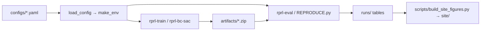

# Reservation pricing and availability control with RL

[](https://github.com/jjd-lab/revenue-manage-rl/actions/workflows/test.yml)
[](LICENSE)


Config-driven **revenue management** framework for a two-lever problem: the agent
sets a **price** and an **availability control** (a selling limit) on every day of
the booking window. Pluggable demand models (tree base + linear elasticity by
default), classical baselines, Stable-Baselines3 **PPO / SAC** (TD3 is registered
and smoke-tested but appears in no published result), and a control layer that can
take the second lever back off the agent.

Both levers matter, and which of them the agent should hold is the question the
experiments answer: a joint policy sets price and limit together, a price-only
policy delegates the limit to an analytic controller, and an oversell cap can
constrain a trained joint policy after the fact.

## The result

On thirty held-out nights, scored so that structurally unfillable soft nights are
measured against a floor-price oracle rather than against capacity, the three
SAC-based joint policies take the top three places. The recommended package is
BC→SAC under the oversell cap: it keeps 99.4% of the raw policy's score and turns
denied admission on 71% of peak nights into none.

| Policy | Levers | `score_aware` | Peak nights with denied admission |
| --- | --- | ---: | ---: |
| BC→SAC (raw) | joint | 2.094M | 0.71 |
| **BC→SAC + oversell cap** | joint | **2.081M** | **0.00** |
| Joint SAC `rl_best` | joint | 2.033M | 0.18 |
| Pace PPO | price only | 2.010M | 0.00 |
| Myopic (perfect-forecast baseline) | price only | 1.972M | 0.00 |

Full table: [`docs/EXPERIMENT_LOG.md`](docs/EXPERIMENT_LOG.md) §7. The chart-led
reading is the [public page](site/index.html) (`/site`, published with GitHub Pages).


*Joint SAC learns a booking curve — protect early, clear late, weekends near $109
and weekdays near $84 — against a flat $92 from the myopic rule. Figures and the
guide: [`runs/explain_rl_best/`](runs/explain_rl_best/README.md).*

## Scenario

A fictional 10,000-seat amphitheater sells seats for a nightly performance across a
100-day advance booking window. Each day the operator sets a **ticket price** and a
**selling limit**, against cancellations, no-shows, weekend and seasonal demand
swings, and a hard capacity wall on the performance date.

Everything here is **synthetic**. The base-demand corpus comes from
`synthetic_base_demand_mean` in `src/reservation_pricing/demand/synthesize.py`, and
the shipped `demand/assets/tree_base_demand.joblib` is fitted on that generated
corpus. No real booking data is used anywhere in this repo.

## Install

```bash
python3 -m venv .venv
source .venv/bin/activate
pip install -U pip
pip install -e ".[dev]"
```

Python 3.10+ (developed on 3.13; CI runs 3.10 and 3.13). Run commands from the
repo root with `.venv` active. `pip install -e ".[dev]"` resolves the version
ranges in `pyproject.toml` fresh; to install the exact set the tables in `runs/`
were produced with instead:

```bash
pip install -r requirements.txt
```

| Command | Purpose |
| --- | --- |
| `rprl-train` | Train one algorithm from an experiment YAML |
| `rprl-eval` | Evaluate a checkpoint against a config |
| `rprl-baselines` | Run the classical baselines only |
| `rprl-bc-sac` | Behaviour-cloning warm start, then SAC |
| `rprl-tune` | Hyperparameter search (needs the `tune` or `dev` extra) |
| `rprl-fit-demand` | Regenerate and refit the tree base-demand asset |

All but `rprl-fit-demand` take `-c <config.yaml>`. `--timesteps`, `--episodes`,
`--run-name` and `--out-dir` override the YAML on the commands where they apply;
`--help` lists each command's flags.

## Quick start

```bash
# Tests (add -m "not slow" to skip the three that train a tiny agent)
pytest -q

# Baselines on the default tree_elastic demand
rprl-baselines -c configs/default.yaml --episodes 20 --out-dir runs/scratch/baselines_tree

# Train PPO from one experiment YAML
rprl-train -c configs/experiment_tree_ppo.yaml --timesteps 20000 --run-name demo_tree_ppo

# Evaluate
rprl-eval -c configs/default.yaml --model artifacts/demo_tree_ppo/final_model.zip --episodes 20 --out-dir runs/scratch/eval

# A/B: prototype linear demand
rprl-baselines -c configs/demand_linear_legacy.yaml --episodes 20 --out-dir runs/scratch/baselines_legacy

# Refit / ship the tree base-demand asset
rprl-fit-demand --n-samples 8000
```

`runs/scratch/` is gitignored; the curated results live beside the scripts that
regenerate them.

## BC → SAC warm-start

```bash
rprl-bc-sac -c configs/experiment_bc_sac.yaml
rprl-eval -c configs/default.yaml --model artifacts/bc_sac/rl_bc_sac_final.zip --algo sac --episodes 30
```

See `runs/bc_sac/NOTES.md` for the held-out verdict vs `artifacts/tree_long/best/rl_best.zip`,
and `runs/bc_sac/comparison.md` for the table it came from. Two rows of that table
(`bc_only`, `bc_sac_bestckpt`) were intermediate checkpoints that were never kept,
so those two rows cannot be reproduced.

## Config-driven design

One YAML can set demand, env, control, algorithm, eval, and tune:

| Block | Role |
| --- | --- |
| `demand.kind` | `tree_elastic` (default) or `linear_legacy` |
| `env.*` | capacity, horizon, cancel/noshow, reward shaping (`env.reward`) |
| `control.*` | `price_only`, `selling_limit`, `early_promo`, `safe_sl`, `mpc` — all off by default |
| `algorithm.name` | `ppo` \| `sac` \| `td3` |
| `train.*` | timesteps, seed, run name, output paths |
| `eval.*` / `tune.*` | episodes, seeds, soft-aware thresholds, selection weight |

`configs/default.yaml` carries the full schema with every control switched off;
every other config overrides a subset of it. Examples: `algo_*.yaml`,
`experiment_*.yaml`, `demand_linear_legacy.yaml`.

## Demand formula (default)

```
base = TreeModel(days_prior, dow, month, is_weekend, is_peak_month, booking_curve_bin)
expected_gross = max(0, base * (1 + elasticity * (price - ref_price) / ref_price))
```

Myopic baseline optimizes price on a 1D grid via `predict_mean` (no free closed
form under tree demand). See `docs/DESIGN.md`.

## Layout

```
configs/                         experiment YAMLs (default.yaml is the full schema)
docs/                            design, eval protocol, experiment log, experiment index
src/reservation_pricing/         package (env, demand, algos, controls, evaluate)
tests/                           smoke + edge coverage; three slow training tests
scripts/                         explain_rl_best.py, build_site_figures.py, run_smoke.sh
artifacts/                       SB3 checkpoints (untracked; retrain locally)
runs/                            eval tables, notes, explainability figures
site/                            the public page and its figures
wiki/                            maintainer notes (conventions, dev commands, log)
```



A named experiment sets `train.run_name`, so training writes
`artifacts/<model_dir>/<ID>/final_model.zip`. The friendly names in the table
below are copies of that file. Which ID belongs where: [`docs/EXPERIMENTS.md`](docs/EXPERIMENTS.md).

## Model checkpoints

**`artifacts/` is not tracked in git.** Trained weights are raw material, not
findings — over half of each checkpoint is optimizer state needed only to resume
training. The findings live in `runs/`, which *is* tracked. You train the
checkpoints yourself:

| Policy | Expected path | Produced by |
| --- | --- | --- |
| joint SAC `rl_best` | `artifacts/tree_long/best/rl_best.zip` | `rprl-train -c configs/tree_long_sac.yaml` |
| joint PPO | `artifacts/tree_long/best/rl_ppo_long_007.zip` | `rprl-train -c configs/tree_long_007.yaml` |
| BC→SAC | `artifacts/bc_sac/rl_bc_sac_final.zip` | `rprl-bc-sac -c configs/experiment_bc_sac.yaml` |
| pace PPO | `artifacts/pace_ppo/rl_pace_ppo.zip` | `rprl-train -c configs/experiment_price_only_pace_ppo.yaml` |
| price-only PPO | `artifacts/price_only_long/rl_ppo_analytic.zip` | `rprl-train -c configs/experiment_price_only_ppo_long.yaml` |

Two caveats. Training writes `<model_dir>/<run_name>/final_model.zip` and
`best/best_model.zip` — the names in the table are curated copies, so you copy
the one you want to keep to the expected path. And SB3 training is not
bit-reproducible across machines, so your numbers will sit near, not exactly on,
the tables in `runs/`.

The oversell cap is config, not a separate checkpoint: `configs/experiment_bc_sac_safe_sl.yaml`.

The reproduce scripts read from `artifacts/` and skip rows whose checkpoint is
missing. Every one evaluates on held-out seeds 0–29.

```bash
python runs/joint_vs_price_only_soft_aware/REPRODUCE.py   # the headline table
python runs/both_goals/final_eval.py                       # oversell cap + MPC table
python scripts/explain_rl_best.py                          # figures in runs/explain_rl_best/
python scripts/build_site_figures.py                       # site/figures/ from the tables above
```

## Docs

- [`site/index.html`](site/index.html) — the public reading: problem, where it sits in the literature, and the charts
- [`docs/DESIGN.md`](docs/DESIGN.md) — architecture, glossary, demand, reward vs metrics, the control layer
- [`docs/EVALUATING_POLICIES.md`](docs/EVALUATING_POLICIES.md) — the policy-quality checklist and the soft-day-aware protocol behind `score_aware`
- [`docs/EXPERIMENT_LOG.md`](docs/EXPERIMENT_LOG.md) — the full experiment arc, takeaways, and the headline table
- [`docs/EXPERIMENTS.md`](docs/EXPERIMENTS.md) — index: which config ran, where its results and checkpoint land
- [`docs/EXTENDING.md`](docs/EXTENDING.md) — add a demand model, algorithm, or controller; multi-product path
- [`runs/explain_rl_best/README.md`](runs/explain_rl_best/README.md) — why the joint SAC behaves as it does, figure by figure
- [`runs/both_goals/NOTES.md`](runs/both_goals/NOTES.md), [`runs/oracle_ceiling/NOTES.md`](runs/oracle_ceiling/NOTES.md) — the oversell cap, the price MPC, and the soft-night fill ceiling
- [`runs/tree_demand_sanity.md`](runs/tree_demand_sanity.md) — early 30k-step sanity check, superseded by the campaigns
- [`wiki/index.md`](wiki/index.md) — maintainer notes: conventions, dev commands, change log

## Contributing and citing

[`CONTRIBUTING.md`](CONTRIBUTING.md) has the checks to run and the values that must
not change. [`CITATION.cff`](CITATION.cff) is the citation record.

## License

[MIT](LICENSE).
